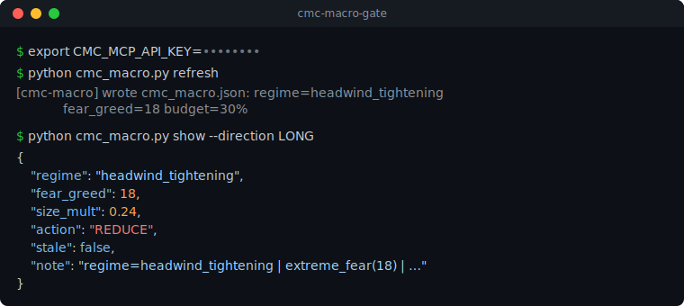

# CMC Macro Gate

[](https://github.com/ipezygj/cmc-macro-gate/actions/workflows/ci.yml)
[](LICENSE)


> **Status: proof-of-concept — feedback & co-building welcome.** This is a
> starting point for a CMC × Hummingbot risk-gate integration, not a finished
> product. PRs, issues, and "I'd do it differently" notes are all very welcome —
> see [Open questions](#open-questions) below.

A tiny, dependency-free **macro risk-budget layer** for any trading engine,
powered by the [CoinMarketCap Skill Hub](https://coinmarketcap.com). Pure Python
standard library — no `pip install` needed.

It pulls CMC's daily market overview (regime, Fear & Greed, suggested risk
budget) and turns it into a single **position-size multiplier** and an
**action** (`NORMAL` / `REDUCE` / `VETO`) your strategy can apply.



## The idea

```
[ collector ]  --MCP/HTTP-->  CoinMarketCap Skill Hub
     | writes
     v
cmc_macro.json   (small cached file on disk)
     | reads (offline, no network)
     v
[ MacroGate ]  -->  your strategy multiplies size / vetoes new longs
```

The **trading hot path never touches the network.** A background collector
refreshes the cache on an interval; the gate just reads the file. If the cache
goes stale (> 24h by default) the gate falls back to a neutral `1.0` multiplier,
so a missed refresh can never silently strangle your sizing.

> The underlying `daily_market_overview` skill is **research-only**, so this is a
> portfolio-wide *risk budget* (how big to size, whether to skip fresh longs),
> **not** a directional buy/sell signal.

## Setup

```bash
export CMC_MCP_API_KEY=...        # your CoinMarketCap MCP key
```

## Refresh the cache

```bash
python cmc_macro.py refresh                 # run once
python cmc_macro.py refresh --loop 3600     # background daemon, hourly
python cmc_macro.py show --direction LONG   # inspect current gate decision
```

Run the daemon alongside your other collectors (systemd, supervisor, nohup, …).

## Use it in a strategy

```python
from cmc_macro import MacroGate

gate = MacroGate("cmc_macro.json")
macro = gate.evaluate(direction="LONG")

size = base_size * macro["size_mult"]        # e.g. base * 0.5 on a risk-off day
if macro["action"] == "VETO":
    skip_trade()
```

`evaluate()` returns:

| field        | meaning                                              |
|--------------|------------------------------------------------------|
| `regime`     | e.g. `headwind_tightening`, `supportive`, `neutral`  |
| `fear_greed` | CMC Fear & Greed index (0–100), or `None`            |
| `size_mult`  | 0–1 multiplier to apply to your position size        |
| `action`     | `NORMAL` / `REDUCE` / `VETO`                          |
| `stale`      | `true` if cache too old → neutralized to `1.0`       |
| `note`       | short human-readable reason string                   |

## Hummingbot integration

The gate is a **pre-flight risk layer** — Hummingbot still owns execution and
any deployment stays user-confirmed. The pattern: run the collector as a
background process, then read the gate in your strategy and scale the order
amount (or skip) before placing orders.

Run the cache refresher alongside your bot:

```bash
python cmc_macro.py refresh --loop 3600 &     # hourly background daemon
```

Then in a `ScriptStrategyBase` script, gate your orders:

```python
from decimal import Decimal
from hummingbot.strategy.script_strategy_base import ScriptStrategyBase
from cmc_macro import MacroGate


class MacroGatedStrategy(ScriptStrategyBase):
    markets = {"binance_paper_trade": {"BTC-USDT"}}

    base_order_amount = Decimal("0.01")
    gate = MacroGate("cmc_macro.json")        # reads the cache, no network

    def on_tick(self):
        macro = self.gate.evaluate(direction="LONG")

        # VETO -> stand down this tick
        if macro["action"] == "VETO":
            self.logger().info(f"Macro veto ({macro['note']}) — no order")
            return

        # otherwise scale the order by the macro size multiplier
        amount = self.base_order_amount * Decimal(str(macro["size_mult"]))
        self.logger().info(
            f"Macro {macro['regime']} (F&G {macro['fear_greed']}) "
            f"-> size x{macro['size_mult']} = {amount}"
        )
        # ... build and submit your OrderCandidate(s) with `amount` ...
```

`evaluate()` does only a local file read, so it's safe to call every tick. The
same `macro["size_mult"]` / `macro["action"]` works just as well inside a
Hummingbot V2 controller's `update_processed_data` / `create_actions_proposal`.

## Tuning

All the mapping lives in two places in `cmc_macro.py`:

- `REGIME_MULTIPLIER` — regime → base size multiplier
- `MacroGate.evaluate()` — extreme-fear penalty, defensive-long caution, the
  `REDUCE`/`VETO` thresholds

Adjust to taste for your venue and risk appetite.

## Files

- `cmc_macro.py` — collector (`refresh`) + gate (`MacroGate`) + CLI, one file
- `example.py` — minimal end-to-end usage demo
- `hummingbot_example.py` — runnable Hummingbot `ScriptStrategyBase` template
- `cmc_macro.json` — generated cache (gitignore it)

## Open questions

This is a proof-of-concept and the design decisions are deliberately up for
debate. Things I'd genuinely love feedback on:

1. **Right CMC skill?** This uses `daily_market_overview` as the macro feed. Is
   that the best source for a risk gate, or would `crypto_macro_overview` /
   `macro_liquidity_monitor` / a per-symbol skill fit better?
2. **Cache vs. live.** The gate reads an offline cache so the trading hot path
   never blocks on the network. Is the hourly refresh cadence + 24h staleness
   fallback sensible, or should it be event-driven?
3. **Regime → multiplier mapping.** The `REGIME_MULTIPLIER` table and the
   extreme-fear / defensive-long rules are first-guess values. What would a
   principled, backtested mapping look like — and is size-scaling the right
   lever vs. gating entry selection?
4. **Hummingbot integration shape.** Is a `ScriptStrategyBase` template the most
   useful entry point, or should this ship as a V2 controller / a reusable
   component for the broader community?
5. **Scope.** Should this stay a tiny single-file gate, or grow into a small
   package with more CMC lanes (ETF flows, cross-asset, news sentiment)?

Issues / PRs / "I'd do it differently" notes all welcome — happy to build this
out together.

## License

MIT — do whatever you like.
